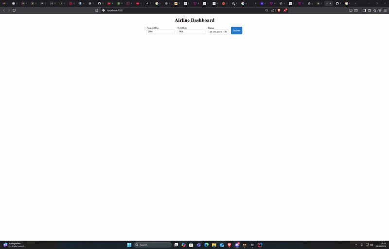

# ✈️ What It Does

Airline Dashboard is a full-stack application that connects to the **Lufthansa Open API** and provides flight search by searching with the departure and destination Airport and date. You can also see details about specific flights
 

---

## 🖥️ Backend (ASP.NET Core Web API)
- Authenticates with Lufthansa via **OAuth2 (client_credentials)**  

---

## 🌐 Frontend (Angular)
- Simple search form for **origin, destination, and date**  
- Displays flights in a table with times and flight numbers  
- Clicking a flight shows details:
  - ✅ Current status (On Time, Delayed, Landed, Cancelled)  
  - 🛫 Departure info (airport, gate, actual/scheduled times)  
  - 🛬 Arrival info (airport, terminal, gate, actual/scheduled times)  
  - ✈️ Aircraft type and operating carrier  

---

## 📊 Summary
- Search for flights  
- See a list of results   


# 🚀 Setup Guide for Airline Dashboard

Follow these steps to get the project running on your machine:

---

## ✅ Requirements
Make sure you have these tools installed:

- [.NET 9 SDK](https://dotnet.microsoft.com/en-us/download)  
- [Node.js (LTS)](https://nodejs.org/en/download/) + npm  
- [Angular CLI](https://angular.dev/cli)  
  ```bash
  npm install -g @angular/cli
  ```
- Git  

---

## 🔧 Setup Instructions

### 1. Clone the Repository
```bash
git clone https://github.com/Berkayy19/AirlineDashboard.git
cd AirlineDashboard
```

### 2. Configure Lufthansa API Credentials
1. Register at the Lufthansa Developer Portal: https://developer.lufthansa.com  
2. Create an app and get your Client ID and Client Secret.  
3. Open `FlightBackend/appsettings.json` and add your credentials:

```json
{
  "Lufthansa": {
    "ClientId": "YOUR_CLIENT_ID_HERE",
    "ClientSecret": "YOUR_CLIENT_SECRET_HERE"
  }
}
```

---

### 3. Run the Backend
```bash
cd FlightBackend
dotnet run
```

---

### 4. Run the Frontend
```bash
cd Frontend
npm install
ng serve
```

---

✅ Now you can search for Lufthansa flights by route, date, or flight number using the Angular frontend.
